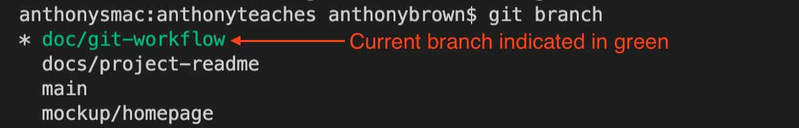

# Git Workflow

This document outlines the recommended workflow for working through a task in the Anthony Teaches project.

## Workflow Steps

1. **[Create/Checkout a Branch](#createcheckout-a-branch)** - `git checkout -b task-type/name-of-objective`
2. **[Open or Review Draft PR](#open-or-review-draft-pr)** - Done on GitHub
3. **[Complete the Tasks](#complete-the-tasks)** - Add: `git add .` | Commit: `git commit -m "My message"` | Push: `git push`
4. **[Publish PR and Request Reviewers](#publish-pr-and-request-reviewers)** - Done on GitHub
5. **[Complete Code Review](#complete-code-review)** - Done on GitHub
6. **[Accept and Merge your PR](#accept-and-merge-your-pr)** - Done no GitHub
7. (Pending completion CD Pipeline) Track and confirm deployment
8. **[Delete Working Branch](#delete-working-branch)** - Done on GitHub and Local: `git branch -d name-of-branch-to-delete`
9. **Start back at Step 1!**


## Create/Checkout a Branch

```bash
git checkout -b task-type/name-of-objective
```

The first step to any work in a collaborative project is to create a unique [branch](https://www.atlassian.com/git/tutorials/using-branches) for the work that you want to complete.

**Before creating your branch** there are few important steps to make sure you are ready to create a new branch.

*First*, ensure you are currently on the main branch. The best way to do this is with a quick `git branch` command. This will list all your local branches, with your *current branch* highlighted in green.



If you aren't currently on `main`, then use the `checkout` command to move yourself to the `main` branch.

```bash
git checkout main
```

*Second*, make sure you have the most up to date code with the `pull` command!

```bash
git pull
```

**🙌 Now you're ready to make a new branch!**

> 📘 Naming your Branch
> 
> A branch name should always be based on the task your are trying to complete. Avoid names like `anthony-work` and instead pick a name based on what you want to complete, such as `homepage-html`.

### Branch Pathing / Task Type Indication

In addition to a branch name, you can help indicate the scope of your task, by prefixing the branch name with one of the task types below, using a `/` as a seperator.

The example below takes the `homepage-html` branch and places it under the `mockup` task type to indicate it's task for design instead of direct integration.
```
git checkout -b mockup/homepage-html
```

**Task Types**

- `feature` - A task that adds to the project
- `patch` - A task that updates existing code in the project
- `mockup` - A task aimed at design or experimention instead of direct integration. A `mockup` branch wont directly merge into `main`, but may be converted into a `feature` or `patch` later on to indicate it's project ready.
- `docs` - A task to work on markdown guides and content

## Open or Review Draft PR

Create a draft PR outlining the goals of the branch, or if your picking up an existing task, review the goals set out by the creator before starting your work.

This helps other collaborators know that the issue is in progress and they are able to see what you plan to implement in your branch so tasks are not duplicated. Bonus: you can also embed a brief loom video of you explaining your code or issue or walking through the development process.

Pro-tip:Include the '#' with the issue number in your main issue comment. (i.e Resolves #52). This automatically will close your issue when the pull request is merged!

## Complete the Tasks

Keep your branch within the scope of the outlined tasks. If you try to take on too many things it can interfere with issues/other branches already in progress. You can always add a new issue and separate branch if you'd like to do discover additional tasks related to your current issue.

If you cannot complete your issue, you can flag your draft PR with a 'help wanted' label inside GitHub.

Embed brief video or include screenshots/code detailing out where you are stuck/highlighting the problem to help other developers help you better. You can tag other github collaborators inside of the initial comment by including an _@username_ inside the comment. (Provides the user with a notification inside Github, including the link to the draftPR)

## Publish PR and Request Reviewers

Convert the draft PR to an open PR, signaling it's ready for review. Indicate what you intended to accomplish with this PR so the reviewer can pull down your branch and know what to watch for without having to review all the code.

Requesting a review from one (or many) fellow collaborator(s) helps the whole team. The reviewers responsibility is to pull your branch down from github, run the code, and review the process you've detailed out. They'll need to make sure the code functions as expected and is inline with project goals and best practices. Providing the reviewer with a concise outline of what the code should do is very important in the review process. Remember to update your project/kanban board with the status (i.e. pull request in review)

## Complete Code Review

Review the edits/feedback to your branch and try to make the updates as quickly as possible to keep the project moving forward. You can respond to the feedback with clarifying questions or status updates directly within github. Make sure to re-request review after you've made changes, as the reviewer will likely want to run/test your branch before approving the PR/merge.

## Accept and Merge your PR

Detail process / Provide images and code for demonstration
## Delete Working Branch

It seems tedious and unimportant, but it only takes a minute! Please help other collaborators keep a tidy workspace by deleting your branch on github and locally after deployment. Deleted branches can be restored, if need be, but keeping unused branches makes things cluttered for the team. When looking at branches and pulling them down, it's important we are all working with the most up to date list. Having 30 stale branches sitting in the list of branches makes it confusing for new and existing collaborators to work with.

Lastly: Ensure your project/kanban board is up to date regarding your issue status. Start over at Step 1 with a new issue/branch if you didn't accomplish all the items included in your original issue!
