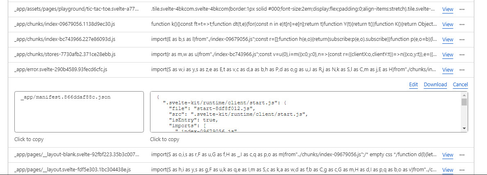
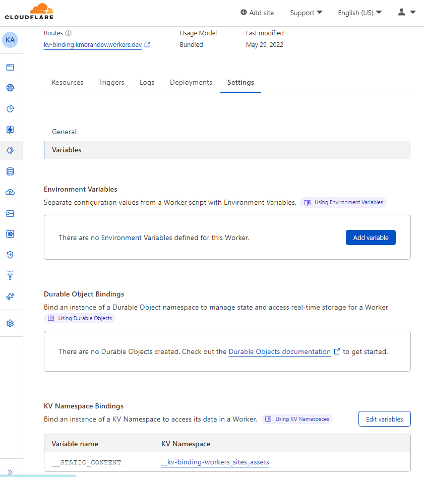

# Using KV (key-value) Stores with Cloudflare Workers

_You'll need to set up CloudFlare workers before this step. See [Cloudflare Workers Setup guide](Cloudflare-Workers-Setup.md)._

Once our app is built and published with Cloudflare workers ([see cloudflare dashboard view](./assets/WorkersPage-preview.PNG)), we'll end up with a few items of note: a _deployed url_, a published _KV namespace+ID_, and a _binding_ to bridge our namespace with our worker.

1. **Live route/deployed url**<br> The KV Worker (**function deployment service**) is used here in a serverless environment.

2. **KV Namespace + Unique ID** <br>The KV store is called a KV namespace by Cloudflare. It is a collection of key-value pairs where all the keys have to be unique. i.e. a database. Each namespace also is assigned its own unique id.
   These are replicated to Cloudflare's edge for efficient retrieval when someone visits our site.<br> <br> The namespace '\_kv-binding-workers_sites_assets' is based on the name I put in my wrangler.toml file.<br>
   [name = "kv-binding", click for PNG](..%5Cwrangler.toml)<br><br>The files from our build are broken down into 'keys' and 'values'. Here is a partial list of keys/values for the published namespace, *\_\_kv-binding-workers*sites_assets\*. You can see the manifest is one key name and the value is the entire manifest.json

3. **KV Binding** <br> This bridges our actual worker with our Namespace. This allows the worker to read data from our KV namespace (i.e. database holding our site files).<br><br>
   A default binding was automatically created for us upon the wrangler publish command. It looks like this in the dashboard:
   
   Notice the route listed up at the top is our deployed url which is a different name than our KV namespace. The binding '\_\_STATIC_CONTENT' is now a global variable we can access in this route/namespace.

# Multiple KV stores/namespaces

As we navigate dynamic data from users being added to our site, we might find we need to add or edit namespaces and bindings. We may have a 'FILES' namespace with it's unique binding, and a generic namespace with it's unique binding. We can have multiple namespaces pointing to the same worker/deployed route.

# Using the Wrangler CLI

In the example here, the namespace and binding were automatically created upon deployment. But what if we wanted to add a namespace forthe guide files in our project and displaying them to the page? We can perform many actions with our namespaces and bindings in the Wrangler CLI (terminal). Below are the common commands we'll be using to do so, along with examples.

## Create a new namespace (KV store) in terminal

```
wrangler kv:namespace create "FILES"

🌀  Creating namespace with title "__kv-binding-FILES'"
✨  Success!
Add the following to your toml configuration file:
kv_namespaces = [
  { binding = "kv-binding-FILES", id = "c3f09adsdsdfdfw1b4740a7f63" }
]
```

## View all namespaces

```
 wrangler kv:namespace list

✨[{"id":"1a71bc7d9a46565dsf4dsb71e","title":"__kv-binding-workers_sites_assets"},

✨{"id":"c3f09adsdsdfdfw1b4740a7f63","title":"kv-binding-FILES"},

✨{"id":"e73de62e65406540ebfbsdf80a","title":"__rock-paper-scissors-workers_sites_assets"}]
```

## Write a value to your KV namespace.

```
wrangler kv:key put --binding=kv-binding-FILES "key" "value"
```

Instead of --binding, you may use --namespace-id to specify which KV namespace should receive the operation:

```
wrangler kv:key put --namespace-id=c3f09adsdsdfdfw1b4740a7f63 "key" "value"
```

Have two+ environments, like development and production? See [Wrangler/Workers-KV docs](https://developers.cloudflare.com/workers/wrangler/workers-kv/).

More wrangler CLI commands to manage your Cloudflare Workers:

[init](https://developers.cloudflare.com/workers/wrangler/commands#init) - Create a skeleton Wrangler project, including the wrangler.toml file.<br>
[dev](https://developers.cloudflare.com/workers/wrangler/commands#dev) - Start a local server for developing your Worker.<br>
[publish](https://developers.cloudflare.com/workers/wrangler/commands#publish) - Publish your Worker to Cloudflare.<br>
[kv:namespace](https://developers.cloudflare.com/workers/wrangler/commands#kvnamespace) - Manage Workers KV namespaces.<br>
[kv:key](https://developers.cloudflare.com/workers/wrangler/commands#kvkey) - Manage key-value pairs within a Workers KV namespace.<br>
[kv:bulk](https://developers.cloudflare.com/workers/wrangler/commands#kvbulk) - Manage multiple key-value pairs within a Workers KV namespace in batches.<br>
[secret](https://developers.cloudflare.com/workers/wrangler/commands#secret) - Manage the secret variables for a Worker.<br>
[tail](https://developers.cloudflare.com/workers/wrangler/commands#tail) - Start a session to livestream logs from a deployed Worker.<br>
[login](https://developers.cloudflare.com/workers/wrangler/commands#login) - Authorize Wrangler with your Cloudflare account using OAuth.<br>
[logout](https://developers.cloudflare.com/workers/wrangler/commands#logout) - Remove Wrangler’s authorization for accessing your account.<br>

_Source: [Cloudflare Wrangler-Commands](https://developers.cloudflare.com/workers/wrangler/commands#kv)_

# KV Javascript CRUD actions

Using asyc/await<br>

**Create**

```js
// await NAMESPACE.put(key, value).
(await kv) - binding - FILES.put(filename, contents);
```

**Read**

```js
// await NAMESPACE.get(key).
(await kv) - binding - FILES.get(filename);
```

Example from [Cloudflare](https://developers.cloudflare.com/workers/runtime-apis/kv/)

```js
addEventListener('fetch', (event) => {
	event.respondWith(handleRequest(event.request));
});

async function handleRequest(request) {
	const value = await NAMESPACE.get('first-key');
	if (value === null) {
		return new Response('Value not found', { status: 404 });
	}

	return new Response(value);
}
```

**List**

```js
//await NAMESPACE.list()
(await kv) - binding - FILES.list();
```

**Delete**

```js
//await NAMESPACE.delete(key)
(await kv) - binding - FILES.delete(filename);
```

<!-- want to add markdown files to the new namespace FILES. It isn't freaking working, however. Resources indicate to add it in the worker file but I don't know which entry point to us.  A kv.ts seems standard to list all the functions out, but then what from there? -->
